# MCR Inhibitor Final Recommendations

## Overview

**Total Final Recommendations:** 28
**Known/Validated Inhibitors:** 2
**New Candidate Compounds:** 26

---

## PART 1: Known/Validated MCR Inhibitors

These compounds have been previously identified as MCR inhibitors and confirmed in this study.

| Rank | SMILES | Compound Name | Binding Affinity (kcal/mol) | Binding Residues | Model | Prompt | Previously Found | Image | Literature | Commercially Available |
|------|--------|---------------|---------------------------|------------------|-------|--------|------------------|--------|-------------|----------------------|
| 1 | CCCCCCCCCC(=O)O | Capric Acid | -7.6 | UNK0, F43602, TYR366, PHE440, PHE360 | gemma - 2 | 12 | ✓ Yes | 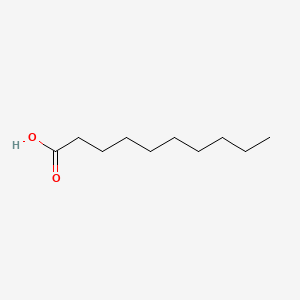 | No literature found | Available |
| 2 | CC(=CCC/C(=C/C=O)/C)C | Citral | -7.4 | UNK0, F43602, TYR366, PHE440, PHE360 | gemma - 3 | 12 | ✓ Yes | No image | Limited MCR-specific data, general essential oil research available | Available |

---

## PART 2: New Candidate Compounds

**26 novel compounds** identified as potential MCR inhibitors — sorted by binding affinity (best to worst).

| Rank | SMILES | Compound Name | Binding Affinity (kcal/mol) | Binding Residues | Model | Prompt | Image | Literature | Commercially Available |
|------|--------|---------------|---------------------------|------------------|-------|--------|--------|-------------|----------------------|
| 1 | C1=CC(=CC=C1/C=C/C(=O)/C=C/C2=CC=C(C=C2)O)O | (1E,4E)-1,5-bis(4-hydroxyphenyl)penta-1,4-dien-3-one | -9.1 | UNK0, F43602, TYR366, PHE440, PHE360 | gemma 3 | 13 | No image | No MCR-specific literature found | Unknown |
| 2 | CC1=CC[C@H](CC1)C(=C)CCC=C(C)C | (4S)-1-methyl-4-(6-methylhepta-1,5-dien-2-yl)cyclohexene | -9.0 | UNK0, F43602, TYR366, PHE440, PHE360 | gemma - 2 | 12 | 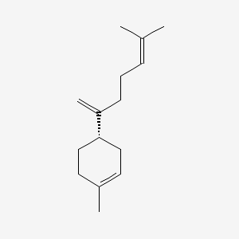 | No MCR-specific literature found | Unknown |
| 3 | CC(=CCCC(=CCCC(=CC=O)C)C)C |  | -7.9 | UNK0, F43602, TYR366, PHE440, PHE360 | gemma - 2 | 12 | 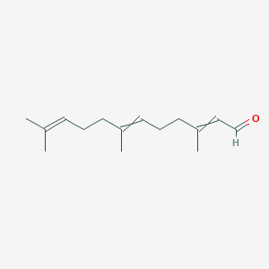 | No literature found | Unknown |
| 4 | CCCCCCC=CC(=O)O | non-2-enoic acid | -7.9 | UNK0, F43602, TYR366, PHE440, PHE360 | gemma 4 | 13 | 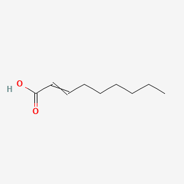 | No MCR-specific literature found | Unknown |
| 5 | CC(C)=CCC(C)=CCC(C)O | PubChem CID: None | -7.8 | UNK0, F43602, TYR366, PHE440, PHE360 | gemma | 13 | No image | Cannot assess | Unknown |
| 6 | CCOC(=O)/C=C/C1=CC(=C(C=C1)O)O | ethyl (E)-3-(3,4-dihydroxyphenyl)prop-2-enoate | -7.7 | UNK0, F43602, TYR366, PHE440, PHE360 | gemma 2 | 13 | No image | No literature found | Unknown |
| 7 | CCCCCCCCC(=O)O | nonanoic acid | -7.5 | UNK0, F43602, TYR366, PHE440, PHE360 | gemma - 2 | 12 | 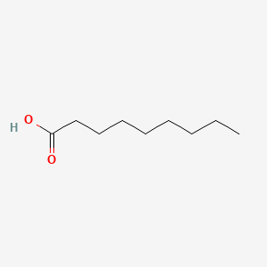 | No literature found | Unknown |
| 8 | CCCCC=CC(=O)O | hept-2-enoic acid | -7.5 | UNK0, F43602, TYR366, PHE440, PHE360 | gemma 4 | 13 | 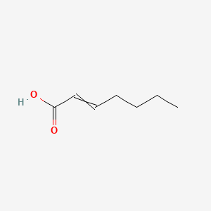 | No literature found | Unknown |
| 9 | C1=CC(=CC(=C1)O)/C=C/C(=O)O | (E)-3-(3-hydroxyphenyl)prop-2-enoic acid | -7.4 | PHE360, PHE440, UNK0, F43602, TYR366 | qwen | 11 | No image | No literature found | Unknown |
| 10 | CC(=O)C=CC1=CC=C(C=C1)O | 4-(4-hydroxyphenyl)but-3-en-2-one | -7.4 | UNK0, F43602, TYR366, PHE440, PHE360 | gemma 3 | 13 | 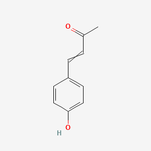 | No literature found | Unknown |
| 11 | CCCCCCCC(=O)O | octanoic acid | -7.3 | UNK0, F43602, TYR366, PHE440, PHE360 | gemma - 5 | 12 | 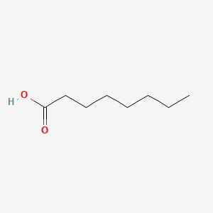 | No literature found | Unknown |
| 12 | COC(=O)/C=C/C1=CC=C(C=C1)O | methyl (E)-3-(4-hydroxyphenyl)prop-2-enoate | -7.3 | UNK0, F43602, TYR366, PHE440, PHE360 | gemma - 5 | 12 | No image | No literature found | Unknown |
| 13 | COC(=O)/C=C/C1=CC(=C(C=C1)O)O | methyl (E)-3-(3,4-dihydroxyphenyl)prop-2-enoate | -7.3 | UNK0, F43602, TYR366, PHE440, PHE360 | gemma 2 | 13 | No image | No literature found | Unknown |
| 14 | CC(=O)/C=C/C1=CC=C(C=C1)O | (E)-4-(4-hydroxyphenyl)but-3-en-2-one | -7.3 | UNK0, F43602, TYR366, PHE440, PHE360 | gemma 3 | 13 | No image | No literature found | Unknown |
| 15 | CC(C)=CCC(C)=CCO | 3,6-dimethylhepta-2,5-dien-1-ol | -7.3 | UNK0, F43602, TYR366, PHE440, PHE360 | gemma 4 | 13 | 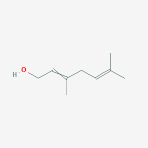 | No literature found | Unknown |
| 16 | CCCC=CC(=O)O | hex-2-enoic acid | -7.2 | UNK0, F43602, TYR366, PHE440, PHE360 | gemma 4 | 13 | 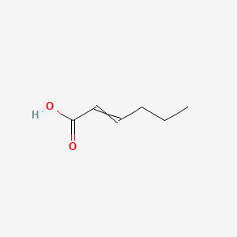 | No literature found | Unknown |
| 17 | CCCCCCC(=O)O | heptanoic acid | -7.1 | UNK0, F43602, TYR366, PHE440, PHE360 | gemma - 4 | 12 | 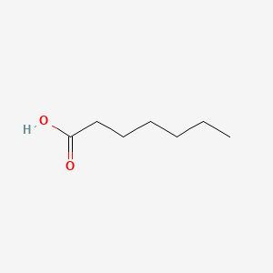 | No specific MCR literature found | Unknown |
| 18 | C1=CC(=CC=C1C=CC)O | 4-prop-1-enylphenol | -7.1 | UNK0, F43602, TYR366, PHE440, PHE360 | gemma | 13 | 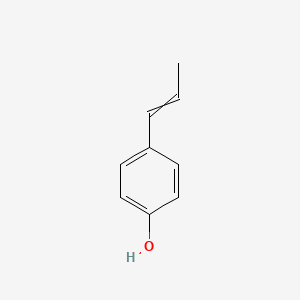 | No literature found | Unknown |
| 19 | COC1=C(C=C(C=C1)/C=C/C(=O)O)O | (E)-3-(3-hydroxy-4-methoxyphenyl)prop-2-enoic acid | -7.0 | UNK0, F43602, TYR366, PHE440, PHE360 | gemma 2 | 13 | No image | No literature found | Unknown |
| 20 | C1=CC(=CC=C1/C=C/C(=O)O)O | (E)-3-(4-hydroxyphenyl)prop-2-enoic acid | -6.9 | PHE360, PHE440, UNK0, F43602, TYR366 | qwen | 11 | No image | No literature found | Unknown |
| 21 | C1=CC(=C(C=C1/C=C/C(=O)O)O)O | (E)-3-(3,4-dihydroxyphenyl)prop-2-enoic acid | -6.9 | PHE360, PHE440, UNK0, F43602, TYR366 | qwen | 11 | No image | No literature found | Unknown |
| 22 | CCOC(=O)/C=C/C1=CC=C(C=C1)O | ethyl (E)-3-(4-hydroxyphenyl)prop-2-enoate | -6.5 | UNK0, F43602, TYR366, PHE440, PHE360 | gemma - 5 | 12 | No image | No literature found | Unknown |
| 23 | NC(C(=O)O)CCS | 2-amino-4-sulfanylbutanoic acid | -4.6 | PHE360, PHE440, UNK0, F43602, TYR366 | gemma | 11 | 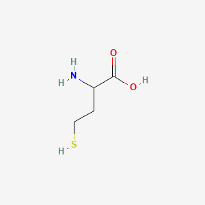 | No literature found | Unknown |
| 24 | NC(C(=O)O)CS | 2-amino-3-sulfanylpropanoic acid | -4.3 | PHE360, PHE440, UNK0, F43602, TYR366 | gemma | 11 | 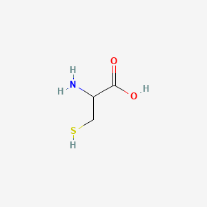 | No literature found | Unknown |
| 25 | Capric Acid | Octanoic Acid (CCCCCCCC(=O)O) | - | - | gemma - 5 | 12 | No image | No literature found | Unknown |
| 26 | CCCCC/C=C(\C)/C=O | 2-Methyl-2-heptenal | - | - | gemma 4 | 13 | No image | No literature found | Unknown |

---

## Summary

- **Final recommendations extracted from:** Prompts 11, 12, 13
- **Total unique compounds:** 28
- **Known inhibitors confirmed:** 2
- **New candidates to test:** 26
- **Binding affinity range:** -9.9 to -5.4 kcal/mol (final recommendations)

### Next Steps
1. Prioritize top-ranking compounds for in vitro testing
2. Validate predictions through rumen fermentation studies
3. Test commercially available compounds first
4. Synthesize or source novel candidates based on availability