# MCR Inhibitor Compounds - Master List

## Overview

**Total Unique Compounds:** 199
**Binding Affinity Range:** -9.9 to -2.7 kcal/mol
**Average Binding Affinity:** -6.65 kcal/mol
**Known Inhibitors (Validated):** 7
**New Compounds with Images:** 110
**Compounds without Images:** 82

---

## Data Organization

This dataset is organized into three sections:

### Part 1: Known/Validated Inhibitors
- **Total:** 7 compounds
- **Status:** Previously identified as MCR inhibitors
- **All have images:** Yes

### Part 2: New Compounds WITH Images
- **Total:** 110 compounds
- **Status:** Novel compounds discovered in this study
- **Organization:** Sorted by binding affinity (best to worst)

### Part 3: Compounds WITHOUT Images
- **Total:** 82 compounds
- **Status:** Could not find in PubChem database
- **Organization:** Sorted by binding affinity (best to worst)

---

## PART 1: Known/Validated MCR Inhibitors

These compounds have been previously identified as MCR inhibitors.

| Rank | SMILES | Compound Name | Binding Affinity (kcal/mol) | Binding Residues | Model | Prompt | Previously Found | Image |
|------|--------|---------------|---------------------------|------------------|-------|--------|------------------|--------|
| 1 | CC[C@H](C)C(=O)O[C@H]1C[C@H](C=C2[C@H]1[C@H]([C@H](C=C2)C)CC[C@@H]3C[C@H](CC(=O)O3)O)C | Lovastatin | -9.6 | UNK0, F43602, TYR366, PHE440, PHE360 | gemma - 3 | 12 | ✓ Yes | 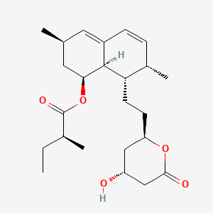 |
| 2 | CCCCCCCCCC(=O)O | Capric Acid | -7.6 | UNK0, F43602, TYR366, PHE440, PHE360 | gemma - 2 | 12 | ✓ Yes |  |
| 3 | CC(=CCC/C(=C/C=O)/C)C | Citral | -7.4 | UNK0, F43602, TYR366, PHE440, PHE360 | gemma - 3 | 12 | ✓ Yes | Image not found |
| 4 | COC1=C(C=CC(=C1)CC=C)O | Eugenol | -6.6 | UNK0, F43602, TYR366, PHE440, PHE360 | gemma - 3 | 12 | ✓ Yes | 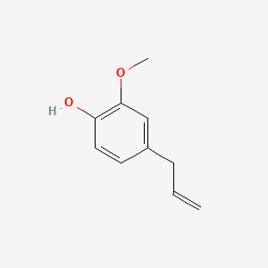 |
| 5 | CC1=CCC(CC1)C(=C)C | Limonene | -6.2 | UNK0, F43602, TYR366, PHE440, PHE360 | gemma - 3 | 12 | ✓ Yes | 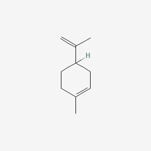 |
| 6 | CC1=CC=C(C=C1)C(C)C | p-cymene | -6.2 | UNK0, F43602, TYR366, PHE440, PHE360 | gemma - 2 | 12 | ✓ Yes | 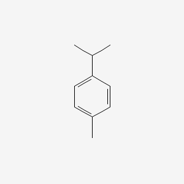 |
| 7 | C(Br)(Br)Br | Bromoform | -3.1 | UNK0, F43602, TYR366, PHE440, PHE360 | gemma - 2 | 12 | ✓ Yes |  |

---

## PART 2: New Compounds WITH Images

### 2A: Mature Prompts (9-13) with Images — Sorted by Binding Affinity

| Rank | SMILES | Compound Name | Binding Affinity (kcal/mol) | Model | Prompt | Image | Literature/MCR Data |
|------|--------|---------------|---------------------------|-------|--------|--------|---------------------|
| 1 | C1C(C[C@H](C([C@@H]1OC(=O)/C=C/C2=CC(=C(C=C2)O)O)O)OC(=O)/C=C/C3=CC(=C(C=C3)O)O)(O)C(=O)O | trans-(3R,5R)-3,5-bis[[(E)-3-(3,4-dihydroxyphenyl)prop-2-enoyl]oxy]-1,4-dihydroxycyclohexane-1-carboxylic acid | -9.7 | crashed 2 - gemma | 9 | No image | No literature found |
| 2 | CCC(C)(C)C(=O)O[C@H]1C[C@H](C=C2[C@H]1[C@H]([C@H](C=C2)C)CC[C@@H]3C[C@H](CC(=O)O3)O)C | [(1S,3R,7S,8S,8aR)-8-[2-[(2R,4R)-4-hydroxy-6-oxooxan-2-yl]ethyl]-3,7-dimethyl-1,2,3,7,8,8a-hexahydronaphthalen-1-yl] 2,2-dimethylbutanoate | -9.5 | gemma - 5 | 12 | 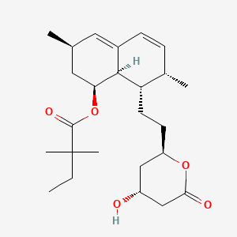 | No literature found |
| 3 | C1=CC(=CC=C1/C=C/C(=O)/C=C/C2=CC=C(C=C2)O)O | (1E,4E)-1,5-bis(4-hydroxyphenyl)penta-1,4-dien-3-one | -9.1 | gemma 3 | 13 | No image | No MCR-specific literature found. Related to natural compounds in plant polyphenol research |
| 4 | C1=CC(=C(C=C1C[C@H](C(=O)O)OC(=O)/C=C/C2=C(C(=C(C=C2)O)O)/C=C/C3=CC(=C(C=C3)O)O)O)O | (2R)-3-(3,4-dihydroxyphenyl)-2-[(E)-3-[2-[(E)-2-(3,4-dihydroxyphenyl)ethenyl]-3,4-dihydroxyphenyl]prop-2-enoyl]oxypropanoic acid | -9.0 | gemma - 2 | 12 | No image | No MCR-specific literature found. Dimer-like structure of hydroxycinnamic acids, novel compound |
| 5 | CC1=CC[C@H](CC1)C(=C)CCC=C(C)C | (4S)-1-methyl-4-(6-methylhepta-1,5-dien-2-yl)cyclohexene | -9.0 | gemma - 2 | 12 |  | No MCR-specific literature found. Related to limonene and other monoterpenes |
| 6 | C1[C@H]([C@@H]([C@@H](C[C@]1(C(=O)O)O)OC(=O)/C=C/C2=CC(=C(C=C2)O)O)OC(=O)/C=C/C3=CC(=C(C=C3)O)O)O | (1R,3R,4S,5R)-3,4-bis[[(E)-3-(3,4-dihydroxyphenyl)prop-2-enoyl]oxy]-1,5-dihydroxycyclohexane-1-carboxylic acid | -8.7 | crashed 2 - gemma | 9 | No image | No MCR-specific literature found. Sugar alcohol + polyphenol hybrid, novel compound |
| 7 | C1=CC(=C(C=C1/C=C/C2=CC(=CC(=C2)O[C@H]3[C@@H]([C@H]([C@@H]([C@H](O3)CO)O)O)O)O)O)O | (2S,3R,4S,5S,6R)-2-[3-[(E)-2-(3,4-dihydroxyphenyl)ethenyl]-5-hydroxyphenoxy]-6-(hydroxymethyl)oxane-3,4,5-triol | -8.6 | gemma 5 | 13 | No image | No literature found |
| 8 | CC(C)=CCC(C)=C1CCC(C1)C=C | PubChem CID: None | -8.5 | gemma 4 | 13 | No image | Cannot assess |
| 9 | COC1=C(C=C(C=C1)C2=CC(=O)C3=C(C=C(C=C3O2)O)O)O | 5,7-dihydroxy-2-(3-hydroxy-4-methoxyphenyl)chromen-4-one | -8.2 | gemma 5 | 13 | 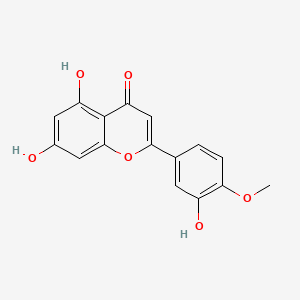 | No MCR-specific literature found. Natural flavonoid structure |
| 10 | C1C(C(C(CC1(C(=O)O)O)OC(=O)/C=C/C2=CC(=C(C=C2)O)O)O)O | 3-[(E)-3-(3,4-dihydroxyphenyl)prop-2-enoyl]oxy-1,4,5-trihydroxycyclohexane-1-carboxylic acid | -8.1 | crashed 2 - gemma | 9 | No image | No MCR-specific literature found. Similar to compounds in your docking study, polyphenol-based |
| 11 | CC(C)=CCC(C)=CC(C)C | PubChem CID: None | -8.1 | gemma 4 | 13 | No image | Cannot assess |
| 12 | C1=CC(=C(C=C1O)C2=CC(=C(C=C2O)C3=CC(=C(C=C3)O)O)O)O | PubChem CID: None | -8.1 | gemma | 10 | No image | Cannot assess |
| 13 | CC1=CCC(CC1)C(=CCC=C(C)C)C | 1-methyl-4-(6-methylhepta-2,5-dien-2-yl)cyclohexene | -8.0 | gemma 3 | 13 | 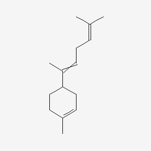 | No MCR-specific literature found. Monoterpene with methyl branch |
| 14 | CCCCCCC=CC(=O)O | non-2-enoic acid | -7.9 | gemma 4 | 13 |  | No MCR-specific literature found. Short-to-medium chain fatty acid |
| 15 | C1=CC(=C(C=C1/C=C/C(=O)O[C@@H](CO)[C@H](C2=CC(=C(C=C2)O)O)O)O)O | [(1S,2S)-1-(3,4-dihydroxyphenyl)-1,3-dihydroxypropan-2-yl] (E)-3-(3,4-dihydroxyphenyl)prop-2-enoate | -7.9 | gemma 5 | 13 | No image | No literature found |
| 16 | C1=CC(=C(C=C1/C=C/C(=O)O[C@@H](CO)[C@@H](C2=CC(=C(C=C2)O)O)O)O)O | [(1R,2S)-1-(3,4-dihydroxyphenyl)-1,3-dihydroxypropan-2-yl] (E)-3-(3,4-dihydroxyphenyl)prop-2-enoate | -7.9 | gemma 5 | 13 | No image | No literature found |
| 17 | CC(=CCCC(=CCCC(=CC=O)C)C)C |  | -7.9 | gemma - 2 | 12 |  | No literature found |
| 18 | CC(C)=CCC(C)=CCC(C)O | PubChem CID: None | -7.8 | gemma | 13 | No image | Cannot assess |
| 19 | C1=CC(=CC=C1/C=C/C2=CC(=CC(=O)O2)O)O | 4-hydroxy-6-[(E)-2-(4-hydroxyphenyl)ethenyl]pyran-2-one | -7.7 | gemma - 4 | 12 | No image | No literature found |
| 20 | CCOC(=O)/C=C/C1=CC(=C(C=C1)O)O | ethyl (E)-3-(3,4-dihydroxyphenyl)prop-2-enoate | -7.7 | gemma 2 | 13 | No image | No literature found |
| 21 | CC(=CCCC(=C)C=C)CCC=C(C)C=O | 2,6-dimethyl-10-methylidenedodeca-2,6,11-trienal | -7.6 | gemma - 2 | 12 | 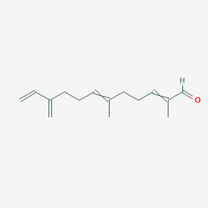 | No literature found |
| 22 | C1=CC(=CC=C1CCC2=CC(=CC(=C2)O)O)O | 5-[2-(4-hydroxyphenyl)ethyl]benzene-1,3-diol | -7.6 | gemma 5 | 13 | 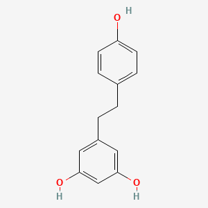 | No literature found |
| 23 | CCCCCCCCCCCC(=O)O | dodecanoic acid | -7.6 | gemma - 5 | 12 | 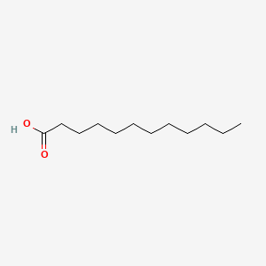 | Published as Lauric acid (C12) - Direct methanogen inhibition + antiprotozoal |
| 24 | C1=CC(=C(C=C1/C=C/C2=CC(=CC(=C2)O)O)O)O | 4-[(E)-2-(3,5-dihydroxyphenyl)ethenyl]benzene-1,2-diol | -7.5 | gemma 5 | 13 | No image | No literature found |
| 25 | CCCCCCCCC(=O)O | nonanoic acid | -7.5 | gemma - 2 | 12 |  | No literature found |
| 26 | CCCCC=CC(=O)O | hept-2-enoic acid | -7.5 | gemma 4 | 13 |  | No literature found |
| 27 | C/C(=C\\CCC(=C)C=C)/CC/C=C(\\C)/C=O | (2E,6E)-2,6-dimethyl-10-methylidenedodeca-2,6,11-trienal | -7.5 | gemma - 2 | 12 | No image | No literature found |
| 28 | C1=CC(=CC=C1/C=C/C2=CC(=CC(=C2)O)O)O | 5-[(E)-2-(4-hydroxyphenyl)ethenyl]benzene-1,3-diol | -7.4 | gemma 5 | 13 | No image | No literature found |
| 29 | C1=CC(=C(C=C1O)O)/C=C/C2=CC(=CC(=C2)O)O | 4-[(E)-2-(3,5-dihydroxyphenyl)ethenyl]benzene-1,3-diol | -7.4 | gemma 5 | 13 | No image | No literature found |
| 30 | C1=CC(=CC=C1CC2=CC=C(C=C2)O)O | 4-[(4-hydroxyphenyl)methyl]phenol | -7.4 | gemma 5 | 13 | 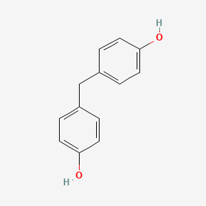 | No literature found |
| 31 | C1=CC(=CC(=C1)O)/C=C/C(=O)O | (E)-3-(3-hydroxyphenyl)prop-2-enoic acid | -7.4 | qwen | 11 | No image | No literature found |
| 32 | CC(=O)C=CC1=CC=C(C=C1)O | 4-(4-hydroxyphenyl)but-3-en-2-one | -7.4 | gemma 3 | 13 |  | No literature found |
| 33 | CCCCCCCCCCCCCCCC(=O)O | hexadecanoic acid | -7.4 | gemma - 2 | 12 |  | No MCR-specific literature found. May have different methanogen effects than medium-chain |
| 34 | CC(C)=CCC(C)=CCO | 3,6-dimethylhepta-2,5-dien-1-ol | -7.3 | gemma 4 | 13 |  | No literature found |
| 35 | C1=CC(=CC=C1/C=C\\C2=CC(=CC(=C2)O)O)O | 5-[(Z)-2-(4-hydroxyphenyl)ethenyl]benzene-1,3-diol | -7.3 | gemma 5 | 13 | No image | No literature found |
| 36 | CC(C1=CC=CC=C1)C2=C(C=C(C=C2)O)O | 4-(1-phenylethyl)benzene-1,3-diol | -7.3 | gemma 5 | 13 | 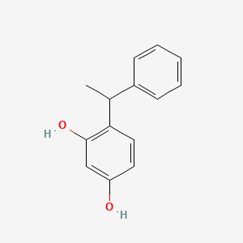 | No literature found |
| 37 | C(=CC=C(C1=CC=C(C=C1)O)O)O | PubChem CID: None | -7.3 | gemma | 10 | No image | Cannot assess |
| 38 | CC(=O)/C=C/C1=CC=C(C=C1)O | (E)-4-(4-hydroxyphenyl)but-3-en-2-one | -7.3 | gemma 3 | 13 | No image | No literature found |
| 39 | C1=CC=C(C=C1O)C=CC(=O)O | 3-(3-hydroxyphenyl)prop-2-enoic acid | -7.3 | gemma | 10 | 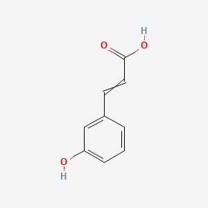 | No literature found |
| 40 | COC(=O)/C=C/C1=CC=C(C=C1)O | methyl (E)-3-(4-hydroxyphenyl)prop-2-enoate | -7.3 | gemma - 5 | 12 | No image | No literature found |
| 41 | CCCCCCCC(=O)O | octanoic acid | -7.3 | gemma - 5 | 12 |  | No literature found |
| 42 | COC1=CC(C=C1)C=CC(=O)O | PubChem CID: None | -7.3 | gemma | 13 | No image | Cannot assess |
| 43 | COC(=O)/C=C/C1=CC(=C(C=C1)O)O | methyl (E)-3-(3,4-dihydroxyphenyl)prop-2-enoate | -7.3 | gemma 2 | 13 | No image | No literature found |
| 44 | CCCC=CC(=O)O | hex-2-enoic acid | -7.2 | gemma 4 | 13 |  | No literature found |
| 45 | C1=CC=C(C(=C1)CC2=CC=C(C=C2)O)O | 2-[(4-hydroxyphenyl)methyl]phenol | -7.2 | gemma 5 | 13 | 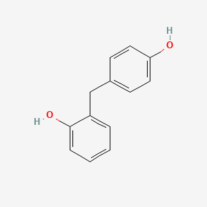 | No literature found |
| 46 | C1=CC(C=C1)C=CC(=O)O | 3-cyclopenta-2,4-dien-1-ylprop-2-enoic acid | -7.2 | gemma | 13 | 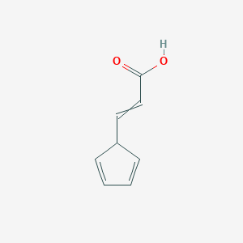 | No literature found |
| 47 | C1=CC(=CC=C1C=CC)O | 4-prop-1-enylphenol | -7.1 | gemma | 13 |  | No literature found |
| 48 | C1=CC=C(C=C1)CC2=C(C=C(C=C2)O)O | 4-benzylbenzene-1,3-diol | -7.1 | gemma 5 | 13 | 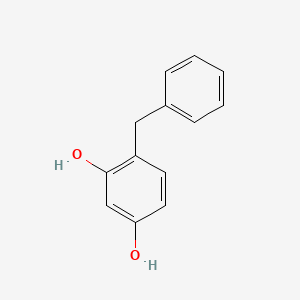 | No literature found |
| 49 | C(=CC=C(C1=CC=C(C=C1)OC)O)O | PubChem CID: None | -7.1 | gemma | 10 | No image | Cannot assess |
| 50 | C1=CC(=C(C=C1O)O)C2=C(C=C(C=C2)O)O | 4-(2,4-dihydroxyphenyl)benzene-1,3-diol | -7.1 | gemma 5 | 13 | 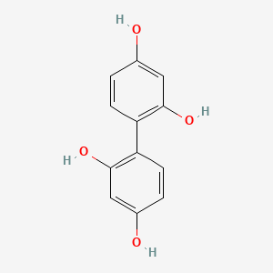 | No literature found |
| 51 | C1=C(C=C(C=C1O)O)C2=C(C=C(C=C2O)O)O | 2-(3,5-dihydroxyphenyl)benzene-1,3,5-triol | -7.1 | gemma 5 | 13 | 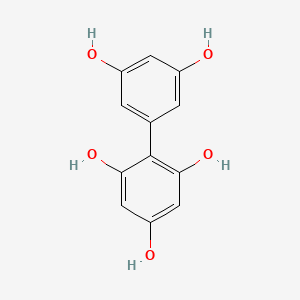 | No literature found |
| 52 | CCCCCCC(=O)O | heptanoic acid | -7.1 | gemma - 4 | 12 |  | No specific MCR literature found |
| 53 | CC(=CCC/C(=C\\C=O)/C)C | (2Z)-3,7-dimethylocta-2,6-dienal | -7.1 | gemma - 2 | 12 | No image | No MCR-specific literature found. Geranial/neral isomer or related compound |
| 54 | C1=CC(=CC=C1/C=C/C(=O)O)[O-] | 4-[(E)-2-carboxyethenyl]phenolate | -7.0 | nemotron | 11 | No image | No literature found |
| 55 | COc1c(cc(cc1)C=CC(=O)O)O | 3-(3-hydroxy-4-methoxyphenyl)prop-2-enoic acid | -7.0 | gpt120 | 11 | 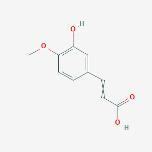 | No literature found |
| 56 | COC1=C(C=C(C=C1)/C=C/C(=O)O)O | (E)-3-(3-hydroxy-4-methoxyphenyl)prop-2-enoic acid | -7.0 | gemma 2 | 13 | No image | No literature found |
| 57 | CCCCC/C=C(\\C)/C=O | (E)-2-methyloct-2-enal | -7.0 | gemma - 4 | 12 | No image | No literature found |
| 58 | C1=CC(=CC=C1/C=C/C(=O)O)O | (E)-3-(4-hydroxyphenyl)prop-2-enoic acid | -6.9 | qwen | 11 | No image | No literature found |
| 59 | COC1=CC=C(C=C1)C=CC(=O)O | 3-(4-methoxyphenyl)prop-2-enoic acid | -6.9 | gemma | 13 | 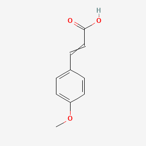 | No literature found |
| 60 | C1=CC(=C(C=C1/C=C\\C(=O)O)O)O | (Z)-3-(3,4-dihydroxyphenyl)prop-2-enoic acid | -6.9 | qwen | 11 | No image | No literature found |
| 61 | COC1=C(C=CC(=C1)C=CC)O | 2-methoxy-4-prop-1-enylphenol | -6.9 | gemma | 13 | 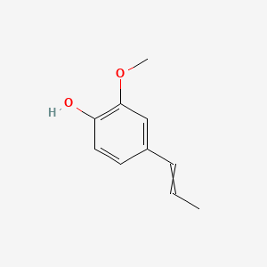 | No literature found |
| 62 | C1=CC(=C(C=C1/C=C/C(=O)O)O)O | (E)-3-(3,4-dihydroxyphenyl)prop-2-enoic acid | -6.9 | qwen | 11 | No image | No literature found |
| 63 | C1=CC(=C(C=C1C=CC(=O)O)O)O | 3-(3,4-dihydroxyphenyl)prop-2-enoic acid | -6.9 | nemotron | 11 | 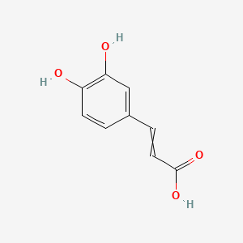 | No literature found |
| 64 | CC(=CCCC(=CC=O)C)C | 3,7-dimethylocta-2,6-dienal | -6.9 | gemma 4 | 13 | 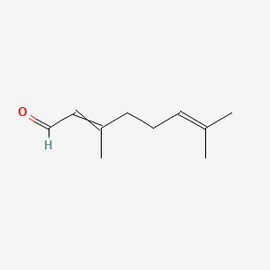 | No literature found |
| 65 | C1=CC=C(C=C1)C2=C(C=CC(=C2)O)O | 2-phenylbenzene-1,4-diol | -6.9 | gemma 5 | 13 | 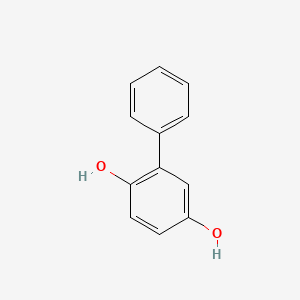 | No literature found |
| 66 | C1=CC(=CC=C1/C=C\\\\C(=O)O)O |  | -6.9 | nemotron | 11 | No image | No literature found |
| 67 | C1=CC(=CC=C1/C=C/C=O)O | (E)-3-(4-hydroxyphenyl)prop-2-enal | -6.9 | gemma - 5 | 12 | No image | No literature found |
| 68 | O=C1C=CC=CC2=C1C=C(OC)C=C2O | PubChem CID: None | -6.8 | gemma | 13 | No image | Cannot assess |
| 69 | C/C=C/C1=CC(=C(C=C1)O)OC | 2-methoxy-4-[(E)-prop-1-enyl]phenol | -6.8 | gemma - 5 | 12 | No image | No literature found |
| 70 | C1=CC(=CC=C1/C=C\\C(=O)O)O | (Z)-3-(4-hydroxyphenyl)prop-2-enoic acid | -6.8 | gemma | 11 | No image | No literature found |
| 71 | COC1=CC(=C(C=C1)C=CC)O | 5-methoxy-2-prop-1-enylphenol | -6.8 | gemma | 13 | 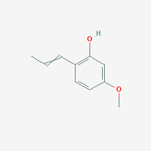 | No literature found |
| 72 | C1=CC(=CC=C1/C=C(\\C(=O)O)/F)O | (E)-2-fluoro-3-(4-hydroxyphenyl)prop-2-enoic acid | -6.8 | gemma - 4 | 12 | No image | No literature found |
| 73 | C1=CC(=C(C=C1O)O)C(=O)O | 2,4-dihydroxybenzoic acid | -6.7 | gemma | 10 | 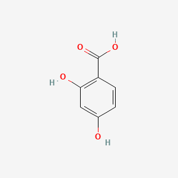 | No literature found |
| 74 | C1=CC(=CC=C1/C=C/CO)O | 4-[(E)-3-hydroxyprop-1-enyl]phenol | -6.7 | gemma 3 | 13 | No image | No literature found |
| 75 | CCC=CC(=O)O | pent-2-enoic acid | -6.7 | gemma 4 | 13 | 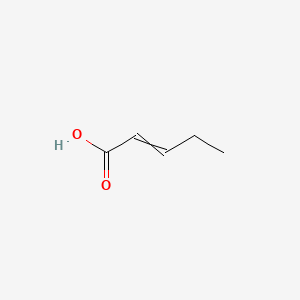 | No literature found |
| 76 | O=C1C=CC=CC2=C1C=C(O)C=C2O | PubChem CID: None | -6.7 | gemma | 13 | No image | Cannot assess |
| 77 | C1=CC(=C(C=C1/C=C/C=O)O)O | (E)-3-(3,4-dihydroxyphenyl)prop-2-enal | -6.7 | gemma 3 | 13 | No image | No literature found |
| 78 | CCCCC(C)C(=O)O | 2-methylhexanoic acid | -6.6 | gemma 4 | 13 | 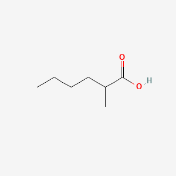 | No literature found |
| 79 | CCCC/C=C(\\CC)/C=O | (E)-2-ethylhept-2-enal | -6.6 | gemma - 4 | 12 | No image | No literature found |
| 80 | CCOC(=O)C1=CC(=C(C(=C1)O)O)O | ethyl 3,4,5-trihydroxybenzoate | -6.6 | gemma | 13 | 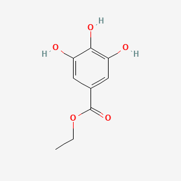 | No literature found |
| 81 | C1=CC2C3C=CC=C3C=CC2=C1 | 8a,8b-dihydro-as-indacene | -6.6 | gemma 5 | 13 | 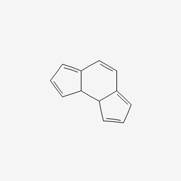 | No literature found |
| 82 | CC1CC=CC(C1)C(=C)C | 5-methyl-3-prop-1-en-2-ylcyclohexene | -6.6 | gemma 5 | 13 | 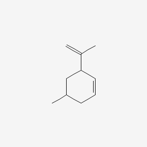 | No literature found |
| 83 | C1=CC(=CC=C1C=C(C#N)C(=O)O)O | 2-cyano-3-(4-hydroxyphenyl)prop-2-enoic acid | -6.5 | gemma - 4 | 12 | 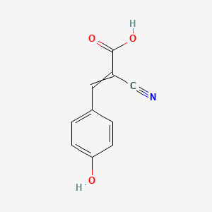 | No literature found |
| 84 | O=C1C=CC=CC2=C1C=CC=C2O | 1-hydroxybenzo[7]annulen-5-one | -6.5 | gemma | 13 | 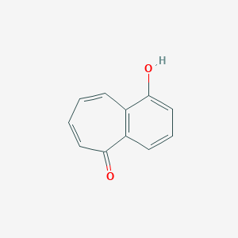 | No literature found |
| 85 | COC1=C(C=CC(=C1)/C=C/C=O)O | (E)-3-(4-hydroxy-3-methoxyphenyl)prop-2-enal | -6.5 | gemma - 5 | 12 | No image | No literature found |
| 86 | CCOC(=O)/C=C/C1=CC=C(C=C1)O | ethyl (E)-3-(4-hydroxyphenyl)prop-2-enoate | -6.5 | gemma - 5 | 12 | No image | No literature found |
| 87 | CCOC(=O)C1=CC=CC=C1N | ethyl 2-aminobenzoate | -6.5 | gemma 4 | 13 | 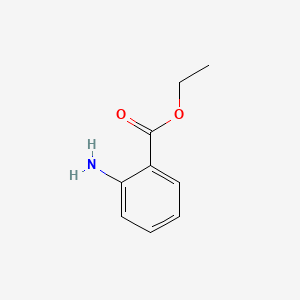 | No literature found |
| 88 | CCC1=CC=CC=C1 | ethylbenzene | -6.4 | gemma - 2 | 12 | 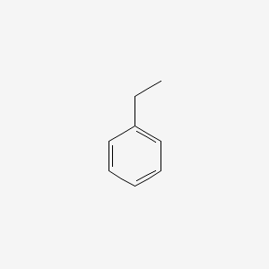 | No literature found |
| 89 | CCCC(C)C(=O)O | 2-methylpentanoic acid | -6.4 | gemma 4 | 13 | 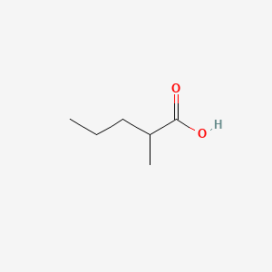 | No literature found |
| 90 | COC1=C(C=CC(=C1)/C=C/C(=O)OC)O | methyl (E)-3-(4-hydroxy-3-methoxyphenyl)prop-2-enoate | -6.4 | gemma 2 | 13 | No image | No literature found |
| 91 | CCCC1=CC(=C(C=C1)O)OC | 2-methoxy-4-propylphenol | -6.4 | gemma - 5 | 12 | 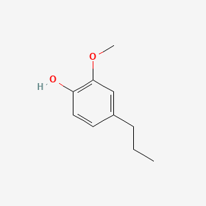 | No literature found |
| 92 | COC(=O)C1=CC=C(C=C1)N | methyl 4-aminobenzoate | -6.4 | gemma | 13 | 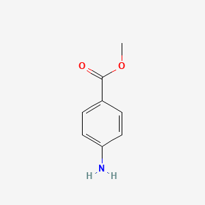 | No literature found |
| 93 | C1=CC=C(C(=C1)/C=C/C=O)O | (E)-3-(2-hydroxyphenyl)prop-2-enal | -6.4 | gemma - 4 | 12 | No image | No literature found |
| 94 | COC1=C(C=CC(=C1)/C=C/C(=O)O)O | (E)-3-(4-hydroxy-3-methoxyphenyl)prop-2-enoic acid | -6.4 | gemma - 5 | 12 | No image | No literature found |
| 95 | C1=CC=C(C(=C1)/C=C\\\\C(=O)O)[O-] |  | -6.3 | nemotron | 11 | No image | No literature found |
| 96 | CC(=O)/C=C/C1=CC=CC=C1O | (E)-4-(2-hydroxyphenyl)but-3-en-2-one | -6.3 | gemma - 4 | 12 | No image | No literature found |
| 97 | COc1=CC(=C(C=C1C=CC(=O)O)OC)O | 3-(4-hydroxy-2,5-dimethoxyphenyl)prop-2-enoic acid | -6.3 | gemma | 11 | 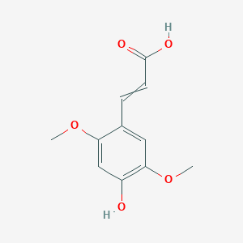 | No literature found |
| 98 | C1=CC=C(C(=C1)/C=C/C(=O)O)O | (E)-3-(2-hydroxyphenyl)prop-2-enoic acid | -6.3 | qwen | 11 | No image | No literature found |
| 99 | CC1=CCC(CC1)C(C)O | 1-(4-methylcyclohex-3-en-1-yl)ethanol | -6.3 | gemma | 13 | 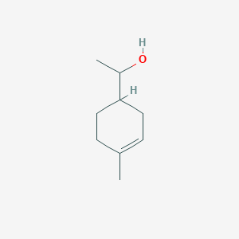 | No literature found |
| 100 | C1=CC(=C(C=C1)/C=C/C(=O)O)O | (E)-3-(2-hydroxyphenyl)prop-2-enoic acid | -6.3 | gemma | 13 | No image | No literature found |
| 101 | C1=CC(=C(C=C1)O)/C=C/C(=O)O | (E)-3-(2-hydroxyphenyl)prop-2-enoic acid | -6.3 | gemma 4 | 13 | No image | No literature found |
| 102 | COC1=C(C=C(C=C1)/C=C/C(=O)O)OC | (E)-3-(3,4-dimethoxyphenyl)prop-2-enoic acid | -6.3 | gemma 2 | 13 | No image | No literature found |
| 103 | C1CC2CCC=C2C=C1 | 2,6,7,7a-tetrahydro-1H-indene | -6.2 | gemma 5 | 13 | 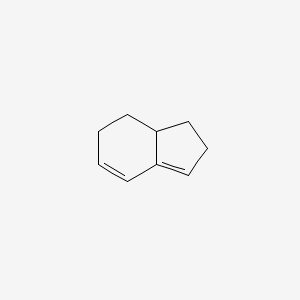 | No literature found |
| 104 | C1=CC(=C(C=C1/C=C\\\\C(=O)O)O)O |  | -6.2 | nemotron | 11 | No image | No literature found |
| 105 | COC(=O)/C=C/C1=CC(=C(C=C1)O)OC | methyl (E)-3-(4-hydroxy-3-methoxyphenyl)prop-2-enoate | -6.2 | gemma | 13 | No image | No literature found |
| 106 | CC1=CC[C@H](CC1)C(=C)C | (4S)-1-methyl-4-prop-1-en-2-ylcyclohexene | -6.2 | gemma - 2 | 12 | 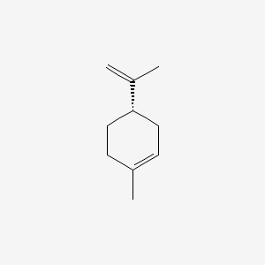 | No literature found |
| 107 | COC1=CC(=C(C=C1OC)C=CC(=O)O)O | 3-(2-hydroxy-4,5-dimethoxyphenyl)prop-2-enoic acid | -6.2 | gemma | 13 | 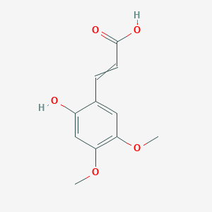 | No literature found |
| 108 | COc1=CC(=CC=C1C=CC(=O)O)O | 3-(4-hydroxy-2-methoxyphenyl)prop-2-enoic acid | -6.2 | gemma | 11 | 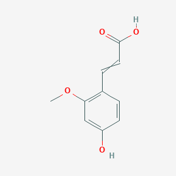 | No literature found |
| 109 | COC1=CC(=C(C=C1)OC)C=CC(=O)O | 3-(2,5-dimethoxyphenyl)prop-2-enoic acid | -6.2 | gemma 4 | 13 | 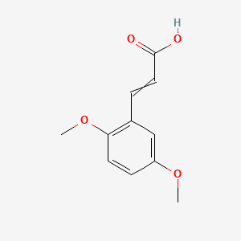 | No literature found |
| 110 | C1=CC(=C(C=C1C(=O)O)O)O | 3,4-dihydroxybenzoic acid | -6.2 | gemma 2 | 13 | 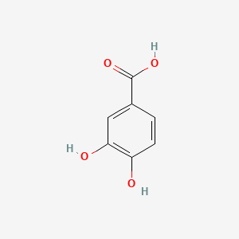 | No literature found |
| 111 | CC(=C)C1=CC=CC=C1 | prop-1-en-2-ylbenzene | -6.2 | gemma - 2 | 12 | 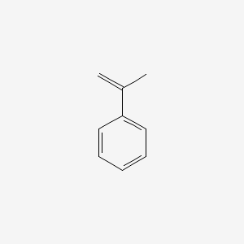 | No literature found |
| 112 | CC1=CC(=C(C=C1)C(C)C)O | 5-methyl-2-propan-2-ylphenol | -6.1 | gemma | 13 | 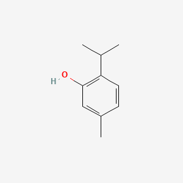 | No literature found |
| 113 | C1CC2C=CC=CC2=C1 | 2,7a-dihydro-1H-indene | -6.1 | gemma 5 | 13 | 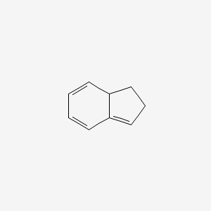 | No literature found |
| 114 | C1=CC=C(C(=C1)/C=C\\\\C(=O)O)O |  | -6.1 | nemotron | 11 | No image | No literature found |
| 115 | C/C=C/C(=O)O | (E)-but-2-enoic acid | -6.1 | gemma | 13 | No image | No literature found |
| 116 | C1=CC=C(C(=C1)/C=C\\C(=O)O)O | (Z)-3-(2-hydroxyphenyl)prop-2-enoic acid | -6.1 | gemma - 4 | 12 | No image | No literature found |
| 117 | CC(C1CCC(CC1)O)C | 4-propan-2-ylcyclohexan-1-ol | -6.1 | gemma | 13 | 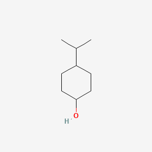 | No literature found |
| 118 | COC1=CC=C(C=C1)C(=O)O | 4-methoxybenzoic acid | -6.1 | gemma 2 | 13 |  | No literature found |
| 119 | COC1=CC(=C(C=C1)C=CC(=O)O)OC | 3-(2,4-dimethoxyphenyl)prop-2-enoic acid | -6.1 | gemma | 10 |  | No literature found |
| 120 | C1CC2CC=CC=C2C1 | 2,3,3a,4-tetrahydro-1H-indene | -6.1 | gemma 5 | 13 |  | No literature found |
| 121 | COC1=CC(=C(C=C1)C=O)O | 2-hydroxy-4-methoxybenzaldehyde | -6.0 | gemma | 13 |  | No literature found |
| 122 | CC1C=CCC2C1C=CC2 | 4-methyl-3a,4,7,7a-tetrahydro-1H-indene | -6.0 | gemma 5 | 13 |  | No literature found |
| 123 | C1CC=C2C=CCC2C1 | 5,6,7,7a-tetrahydro-1H-indene | -6.0 | gemma 5 | 13 |  | No literature found |
| 124 | CC1=CC[C@@H](CC1)C(=C)C | (4R)-1-methyl-4-prop-1-en-2-ylcyclohexene | -6.0 | gemma - 2 | 12 |  | No literature found |
| 125 | C1=CC=C(C=C1)C(=O)O | benzoic acid | -6.0 | gemma | 13 |  | No specific MCR literature found |
| 126 | COC1=CC(=C(C=C1)O)C(=O)O | 2-hydroxy-5-methoxybenzoic acid | -5.9 | gemma | 10 |  | No literature found |
| 127 | CC1=CCC(=CC1)C(C)C | 1-methyl-4-propan-2-ylcyclohexa-1,4-diene | -5.9 | gemma - 5 | 12 |  | No literature found |
| 128 | C=CC[S@](=O)C[C@@H](C(=O)O)N | (2R)-2-amino-3-[(S)-prop-2-enylsulfinyl]propanoic acid | -5.9 | qwen | 11 |  | No literature found |
| 129 | C/C=C/S(=O)C[C@@H](C(=O)O)N | (2R)-2-amino-3-[(E)-prop-1-enyl]sulfinylpropanoic acid | -5.9 | gemma | 11 | No image | No literature found |
| 130 | CC(C1=CC(=C(C=C1)O)C)C | 2-methyl-4-propan-2-ylphenol | -5.8 | gemma | 13 |  | No literature found |
| 131 | C=CCS(=O)C[C@@H](C(=O)N)O | PubChem CID: None | -5.8 | gpt120 | 11 | No image | Cannot assess |
| 132 | COC1=C(C=CC(=C1)C=C)O | 4-ethenyl-2-methoxyphenol | -5.8 | gemma - 2 | 12 |  | No literature found |
| 133 | OC1=CC(=C(C=C1C(=O)O)O)O | 2,4,5-trihydroxybenzoic acid | -5.8 | gemma 2 | 13 |  | No literature found |
| 134 | CCCC(=O)O | butanoic acid | -5.8 | gemma | 13 |  | No literature found |
| 135 | C1=CC=C(C(=C1)C(=O)O)N | 2-aminobenzoic acid | -5.8 | gemma 2 | 13 |  | No literature found |
| 136 | NC1=CC=CC=C1C(=O)O | 2-aminobenzoic acid | -5.8 | gemma | 13 |  | No literature found |
| 137 | CC1CC2CCC1(C)C2=O | PubChem CID: None | -5.8 | gemma | 13 | No image | Cannot assess |
| 138 | CC1=CC[C@@H]2C[C@H]1C2(C)C | (1R,5R)-2,6,6-trimethylbicyclo[3.1.1]hept-2-ene | -5.7 | gemma - 5 | 12 |  | No literature found |
| 139 | CC1=CC=C(C=C1)C | 1,4-xylene | -5.7 | gemma - 2 | 12 |  | No literature found |
| 140 | CC1=CCC2CC1C2(C)C | 2,6,6-trimethylbicyclo[3.1.1]hept-2-ene | -5.7 | gemma - 2 | 12 |  | No literature found |
| 141 | COC1=C(C(=CC=C1)OC)C(=O)O | 2,6-dimethoxybenzoic acid | -5.7 | gemma 2 | 13 |  | No literature found |
| 142 | COC1=CC(=C(C=C1O)C(=O)O)OC | 5-hydroxy-2,4-dimethoxybenzoic acid | -5.7 | gemma | 10 |  | No literature found |
| 143 | COC(=O)C1=CC(=C(C(=C1)O)O)O | methyl 3,4,5-trihydroxybenzoate | -5.6 | gemma | 13 |  | No literature found |
| 144 | C=CCS(=O)CC(C(=O)O)N | 2-amino-3-prop-2-enylsulfinylpropanoic acid | -5.6 | qwen | 11 |  | No literature found |
| 145 | C/C=C/S(=O)C[C@@H](C(=O)[O-])[NH3+] | (2R)-2-azaniumyl-3-[(E)-prop-1-enyl]sulfinylpropanoate | -5.6 | nemotron | 11 | No image | No literature found |
| 146 | CC1CCC=C(C1C)C | 1,5,6-trimethylcyclohexene | -5.5 | gemma 5 | 13 |  | No literature found |
| 147 | C=CCS(=O)C[C@@H](C(=O)O)N | (2R)-2-amino-3-prop-2-enylsulfinylpropanoic acid | -5.5 | qwen | 11 |  | No literature found |
| 148 | COC1=CC(=C(C=C1)C=CC)OC | 2,4-dimethoxy-1-prop-1-enylbenzene | -5.5 | gemma | 13 |  | No literature found |
| 149 | COC(=O)[C@@H](N)C[S@](=O)CC=C | PubChem CID: None | -5.5 | gemma - 5 | 12 | No image | Cannot assess |
| 150 | COC1=C(C=C(C=C1)CC=C)OC | 1,2-dimethoxy-4-prop-2-enylbenzene | -5.5 | gemma - 2 | 12 |  | No literature found |
| 151 | CC1=CC[C@H]2C[C@@H]1C2(C)C | (1S,5S)-2,6,6-trimethylbicyclo[3.1.1]hept-2-ene | -5.4 | gemma - 2 | 12 |  | No literature found |
| 152 | CC1CC2CCC1(C)C2O | PubChem CID: None | -5.4 | gemma | 13 | No image | Cannot assess |
| 153 | COC1=CC(=C(C(=C1)O)OC)C(=O)O | 3-hydroxy-2,5-dimethoxybenzoic acid | -5.3 | gemma | 13 |  | No literature found |
| 154 | CC1=CC(=C(C=C1)O)OC | 2-methoxy-4-methylphenol | -5.3 | gemma - 4 | 12 |  | No literature found |
| 155 | C=CCSCC(C(=O)O)N | 2-amino-3-prop-2-enylsulfanylpropanoic acid | -5.3 | qwen | 11 |  | No literature found |
| 156 | C=CCSC[C@@H](C(=O)O)N | (2R)-2-amino-3-prop-2-enylsulfanylpropanoic acid | -5.3 | qwen | 11 |  | No literature found |
| 157 | CC1C=CCCC1C(=C)C | 3-methyl-4-prop-1-en-2-ylcyclohexene | -5.3 | gemma 5 | 13 |  | No literature found |
| 158 | CC1=CC=CC=C1C | 1,2-xylene | -5.3 | gemma - 2 | 12 |  | No literature found |
| 159 | CS(=O)CC[C@@H](C(=O)O)N | (2S)-2-amino-4-methylsulfinylbutanoic acid | -5.2 | nemotron | 11 |  | No literature found |
| 160 | CNC1=CC=CC=C1C(=O)OC | methyl 2-(methylamino)benzoate | -5.1 | gemma 5 | 13 |  | No literature found |
| 161 | CC1CC=C(CC1C)C | 1,4,5-trimethylcyclohexene | -5.1 | gemma 5 | 13 |  | No literature found |
| 162 | C=CC[S][C@@H](C(=O)O)N | PubChem CID: None | -5.1 | gemma 4 | 13 | No image | Cannot assess |
| 163 | C1=CC(=C(C(=C1)O)O)O | benzene-1,2,3-triol | -4.9 | gemma 5 | 13 |  | No literature found |
| 164 | NC(C(=O)O)CCS | 2-amino-4-sulfanylbutanoic acid | -4.6 | gemma | 11 |  | No literature found |
| 165 | CS(C)C(N)C(=O)O |  | -4.4 | gemma | 11 | No image | No literature found |
| 166 | C(C(C(=O)O)N)S |  | -4.4 | gemma 3 | 13 |  | No literature found |
| 167 | NC(C(=O)O)CS | 2-amino-3-sulfanylpropanoic acid | -4.3 | gemma | 11 |  | No literature found |
| 168 | [2H]C([2H])(Br)Br | dibromo(dideuterio)methane | -3.2 | gemma - 2 | 12 |  | No specific literature found. Deuterium substitution; likely similar MCR activity to bromoform |
| 169 | C(Br)Br | dibromomethane | -3.2 | gemma - 2 | 12 |  | Published MCR inhibition literature - MCR inhibitor; longer half-life than bromoform (775 vs 26 min) |
| 170 | [13CH](Br)(Br)Br | tribromo(113C)methane | -3.1 | gemma - 2 | 12 |  | No specific literature found. Carbon-13 labeled; used for tracking studies |
| 171 | [2H]C(Br)(Br)Br | tribromo(deuterio)methane | -3.1 | gemma - 2 | 12 |  | No specific literature found. Deuterium labeled; used for tracking studies |
| 172 | C(I)(I)I | iodoform | -2.7 | gemma - 5 | 12 |  | Published MCR inhibition literature - Halomethane MCR inhibitor |

### 2B: Early Prompts (1-8) with Images — Sorted by Binding Affinity

| Rank | SMILES | Compound Name | Binding Affinity (kcal/mol) | Model | Prompt | Image | Literature/MCR Data |
|------|--------|---------------|---------------------------|-------|--------|--------|---------------------|
| 1 | C1[C@H]([C@@H]([C@@H](C[C@]1(C(=O)O)OC(=O)/C=C/C2=CC(=C(C=C2)O)O)OC(=O)/C=C/C3=CC(=C(C=C3)O)O)O)O | (1R,3R,4S,5R)-1,3-bis[[(E)-3-(3,4-dihydroxyphenyl)prop-2-enoyl]oxy]-4,5-dihydroxycyclohexane-1-carboxylic acid | -9.9 | qwen3-vl:235b.md | 6 | No image | No literature found |
| 2 | O=[N+]([O-])OCCCCc1ccc(C#N)cc1F | PubChem CID: None | -8.6 | unknown | 1 | No image | Cannot assess |
| 3 | O=[N+]([O-])OCCCCc1ccc(C(F)(F)F)cc1 | PubChem CID: None | -8.6 | unknown | 1 | No image | Cannot assess |
| 4 | C1[C@H]([C@H]([C@@H](C[C@@]1(C(=O)O)O)OC(=O)/C=C/C2=CC(=C(C=C2)O)O)OC(=O)/C=C/C3=CC(=C(C=C3)O)O)O | (1S,3R,4R,5R)-3,4-bis[[(E)-3-(3,4-dihydroxyphenyl)prop-2-enoyl]oxy]-1,5-dihydroxycyclohexane-1-carboxylic acid | -8.6 | qwen - sas - fail.md | 7 | No image | No literature found |
| 5 | O=[N+]([O-])CCCCc1ccc(C(F)(F)F)cc1 | PubChem CID: None | -8.4 | unknown | 4 | No image | Cannot assess |
| 6 | O=[N+]([O-])OCCCCc1ccc(O)cc1 | PubChem CID: None | -8.4 | unknown | 1 | No image | Cannot assess |
| 7 | O=[N+]([O-])OCCCCc1ccc(F)cc1 | PubChem CID: None | -8.3 | unknown | 1 | No image | Cannot assess |
| 8 | C1[C@H]([C@H]([C@@H](C[C@@]1(C(=O)O)O)OC(=O)/C=C/C2=CC(=C(C=C2)O)O)O)O | (1S,3R,4R,5R)-3-[(E)-3-(3,4-dihydroxyphenyl)prop-2-enoyl]oxy-1,4,5-trihydroxycyclohexane-1-carboxylic acid | -8.3 | qwen3-vl:235b.md | 6 | No image | No literature found |
| 9 | O=[N+]([O-])CCCCc1ccc(C#N)cc1 | PubChem CID: None | -8.3 | unknown | 4 | No image | Cannot assess |
| 10 | O=[N+]([O-])CCCCc1ccc(C#N)cc1F | PubChem CID: None | -8.2 | unknown | 4 | No image | Cannot assess |
| 11 | O=[N+]([O-])OCCCCc1ccc([N+](=O)[O-])cc1 | PubChem CID: None | -8.2 | unknown | 1 | No image | Cannot assess |
| 12 | C1[C@H]([C@@H]([C@@H](C[C@]1(C(=O)O)O)OC(=O)/C=C/C2=CC(=C(C=C2)O)O)O)O | (1R,3R,4S,5R)-3-[(E)-3-(3,4-dihydroxyphenyl)prop-2-enoyl]oxy-1,4,5-trihydroxycyclohexane-1-carboxylic acid | -8.2 | gpt-oss120 | 7 | No image | No literature found |
| 13 | C1=CC(=C(C=C1CC(C(=O)O)OC(=O)C=CC2=CC(=C(C=C2)O)O)O)O | 3-(3,4-dihydroxyphenyl)-2-[3-(3,4-dihydroxyphenyl)prop-2-enoyloxy]propanoic acid | -8.1 | qwen - sas - fail.md | 7 |  | No literature found |
| 14 | C1=CC(=C(C=C1C[C@H](C(=O)O)OC(=O)/C=C/C2=CC(=C(C=C2)O)O)O)O | (2R)-3-(3,4-dihydroxyphenyl)-2-[(E)-3-(3,4-dihydroxyphenyl)prop-2-enoyl]oxypropanoic acid | -7.9 | qwen3-vl:235b.md | 6 | No image | No literature found |
| 15 | COC1=C(C=CC(=C1)/C=C/C(=O)O[C@@H]2C[C@@](C[C@H]([C@H]2O)O)(C(=O)O)O)O | (1S,3R,4R,5R)-1,3,4-trihydroxy-5-[(E)-3-(4-hydroxy-3-methoxyphenyl)prop-2-enoyl]oxycyclohexane-1-carboxylic acid | -7.8 | gpt-oss120 | 7 | No image | No literature found |
| 16 | O=[N+]([O-])c1ccc(C(F)(F)F)cc1 | 1-nitro-4-(trifluoromethyl)benzene | -7.1 | unknown | 4 |  | No literature found |
| 17 | O=[N+]([O-])OCCCCc1ccc(C#N)cc1 | PubChem CID: None | -7.0 | unknown | 1 | No image | Cannot assess |
| 18 | O=[N+]([O-])c1ccc(C#N)cc1F | 3-fluoro-4-nitrobenzonitrile | -6.3 | unknown | 4 |  | No literature found |
| 19 | O=[N+]([O-])c1ccc(F)cc1 | 1-fluoro-4-nitrobenzene | -6.2 | unknown | 4 |  | No literature found |
| 20 | O=[N+]([O-])c1ccc(C#N)cc1 | 4-nitrobenzonitrile | -5.9 | unknown | 4 |  | No literature found |

---

## PART 3: Compounds WITHOUT Images (To Be Validated)

### 3A: Mature Prompts (9-13) without Images — Sorted by Binding Affinity

| Rank | SMILES | Compound Name | Binding Affinity (kcal/mol) | Binding Residues | Model | Prompt | Previously Found |
|------|--------|---------------|---------------------------|------------------|-------|--------|------------------|
| 1 | C1C(C[C@H](C([C@@H]1OC(=O)/C=C/C2=CC(=C(C=C2)O)O)O)OC(=O)/C=C/C3=CC(=C(C=C3)O)O)(O)C(=O)O | trans-(3R,5R)-3,5-bis[[(E)-3-(3,4-dihydroxyphenyl)prop-2-enoyl]oxy]-1,4-dihydroxycyclohexane-1-carboxylic acid | -9.7 | UNK0, F43602, TYR366, PHE440, PHE360 | crashed 2 - gemma | 9 | No |
| 2 | C1=CC(=CC=C1/C=C/C(=O)/C=C/C2=CC=C(C=C2)O)O | (1E,4E)-1,5-bis(4-hydroxyphenyl)penta-1,4-dien-3-one | -9.1 | UNK0, F43602, TYR366, PHE440, PHE360 | gemma 3 | 13 | No |
| 3 | C1=CC(=C(C=C1C[C@H](C(=O)O)OC(=O)/C=C/C2=C(C(=C(C=C2)O)O)/C=C/C3=CC(=C(C=C3)O)O)O)O | (2R)-3-(3,4-dihydroxyphenyl)-2-[(E)-3-[2-[(E)-2-(3,4-dihydroxyphenyl)ethenyl]-3,4-dihydroxyphenyl]prop-2-enoyl]oxypropanoic acid | -9.0 | UNK0, F43602, TYR366, PHE440, PHE360 | gemma - 2 | 12 | No |
| 4 | C1[C@H]([C@@H]([C@@H](C[C@]1(C(=O)O)O)OC(=O)/C=C/C2=CC(=C(C=C2)O)O)OC(=O)/C=C/C3=CC(=C(C=C3)O)O)O | (1R,3R,4S,5R)-3,4-bis[[(E)-3-(3,4-dihydroxyphenyl)prop-2-enoyl]oxy]-1,5-dihydroxycyclohexane-1-carboxylic acid | -8.7 | UNK0, F43602, TYR366, PHE440, PHE360 | crashed 2 - gemma | 9 | No |
| 5 | C1=CC(=C(C=C1/C=C/C2=CC(=CC(=C2)O[C@H]3[C@@H]([C@H]([C@@H]([C@H](O3)CO)O)O)O)O)O)O | (2S,3R,4S,5S,6R)-2-[3-[(E)-2-(3,4-dihydroxyphenyl)ethenyl]-5-hydroxyphenoxy]-6-(hydroxymethyl)oxane-3,4,5-triol | -8.6 | UNK0, F43602, TYR366, PHE440, PHE360 | gemma 5 | 13 | No |
| 6 | CC(C)=CCC(C)=C1CCC(C1)C=C | PubChem CID: None | -8.5 | UNK0, F43602, TYR366, PHE440, PHE360 | gemma 4 | 13 | No |
| 7 | C1C(C(C(CC1(C(=O)O)O)OC(=O)/C=C/C2=CC(=C(C=C2)O)O)O)O | 3-[(E)-3-(3,4-dihydroxyphenyl)prop-2-enoyl]oxy-1,4,5-trihydroxycyclohexane-1-carboxylic acid | -8.1 | UNK0, F43602, TYR366, PHE440, PHE360 | crashed 2 - gemma | 9 | No |
| 8 | CC(C)=CCC(C)=CC(C)C | PubChem CID: None | -8.1 | UNK0, F43602, TYR366, PHE440, PHE360 | gemma 4 | 13 | No |
| 9 | C1=CC(=C(C=C1O)C2=CC(=C(C=C2O)C3=CC(=C(C=C3)O)O)O)O | PubChem CID: None | -8.1 | UNK0, F43602, TYR366, PHE440, PHE360 | gemma | 10 | No |
| 10 | C1=CC(=C(C=C1/C=C/C(=O)O[C@@H](CO)[C@H](C2=CC(=C(C=C2)O)O)O)O)O | [(1S,2S)-1-(3,4-dihydroxyphenyl)-1,3-dihydroxypropan-2-yl] (E)-3-(3,4-dihydroxyphenyl)prop-2-enoate | -7.9 | UNK0, F43602, TYR366, PHE440, PHE360 | gemma 5 | 13 | No |
| 11 | C1=CC(=C(C=C1/C=C/C(=O)O[C@@H](CO)[C@@H](C2=CC(=C(C=C2)O)O)O)O)O | [(1R,2S)-1-(3,4-dihydroxyphenyl)-1,3-dihydroxypropan-2-yl] (E)-3-(3,4-dihydroxyphenyl)prop-2-enoate | -7.9 | UNK0, F43602, TYR366, PHE440, PHE360 | gemma 5 | 13 | No |
| 12 | CC(C)=CCC(C)=CCC(C)O | PubChem CID: None | -7.8 | UNK0, F43602, TYR366, PHE440, PHE360 | gemma | 13 | No |
| 13 | C1=CC(=CC=C1/C=C/C2=CC(=CC(=O)O2)O)O | 4-hydroxy-6-[(E)-2-(4-hydroxyphenyl)ethenyl]pyran-2-one | -7.7 | UNK0, F43602, TYR366, PHE440, PHE360 | gemma - 4 | 12 | No |
| 14 | CCOC(=O)/C=C/C1=CC(=C(C=C1)O)O | ethyl (E)-3-(3,4-dihydroxyphenyl)prop-2-enoate | -7.7 | UNK0, F43602, TYR366, PHE440, PHE360 | gemma 2 | 13 | No |
| 15 | C1=CC(=C(C=C1/C=C/C2=CC(=CC(=C2)O)O)O)O | 4-[(E)-2-(3,5-dihydroxyphenyl)ethenyl]benzene-1,2-diol | -7.5 | UNK0, F43602, TYR366, PHE440, PHE360 | gemma 5 | 13 | No |
| 16 | C/C(=C\\CCC(=C)C=C)/CC/C=C(\\C)/C=O | (2E,6E)-2,6-dimethyl-10-methylidenedodeca-2,6,11-trienal | -7.5 | UNK0, F43602, TYR366, PHE440, PHE360 | gemma - 2 | 12 | No |
| 17 | C1=CC(=CC=C1/C=C/C2=CC(=CC(=C2)O)O)O | 5-[(E)-2-(4-hydroxyphenyl)ethenyl]benzene-1,3-diol | -7.4 | UNK0, F43602, TYR366, PHE440, PHE360 | gemma 5 | 13 | No |
| 18 | C1=CC(=C(C=C1O)O)/C=C/C2=CC(=CC(=C2)O)O | 4-[(E)-2-(3,5-dihydroxyphenyl)ethenyl]benzene-1,3-diol | -7.4 | UNK0, F43602, TYR366, PHE440, PHE360 | gemma 5 | 13 | No |
| 19 | C1=CC(=CC(=C1)O)/C=C/C(=O)O | (E)-3-(3-hydroxyphenyl)prop-2-enoic acid | -7.4 | PHE360, PHE440, UNK0, F43602, TYR366 | qwen | 11 | No |
| 20 | C1=CC(=CC=C1/C=C\\C2=CC(=CC(=C2)O)O)O | 5-[(Z)-2-(4-hydroxyphenyl)ethenyl]benzene-1,3-diol | -7.3 | UNK0, F43602, TYR366, PHE440, PHE360 | gemma 5 | 13 | No |
| 21 | C(=CC=C(C1=CC=C(C=C1)O)O)O | PubChem CID: None | -7.3 | UNK0, F43602, TYR366, PHE440, PHE360 | gemma | 10 | No |
| 22 | CC(=O)/C=C/C1=CC=C(C=C1)O | (E)-4-(4-hydroxyphenyl)but-3-en-2-one | -7.3 | UNK0, F43602, TYR366, PHE440, PHE360 | gemma 3 | 13 | No |
| 23 | COC(=O)/C=C/C1=CC=C(C=C1)O | methyl (E)-3-(4-hydroxyphenyl)prop-2-enoate | -7.3 | UNK0, F43602, TYR366, PHE440, PHE360 | gemma - 5 | 12 | No |
| 24 | COC1=CC(C=C1)C=CC(=O)O | PubChem CID: None | -7.3 | UNK0, F43602, TYR366, PHE440, PHE360 | gemma | 13 | No |
| 25 | COC(=O)/C=C/C1=CC(=C(C=C1)O)O | methyl (E)-3-(3,4-dihydroxyphenyl)prop-2-enoate | -7.3 | UNK0, F43602, TYR366, PHE440, PHE360 | gemma 2 | 13 | No |
| 26 | C(=CC=C(C1=CC=C(C=C1)OC)O)O | PubChem CID: None | -7.1 | UNK0, F43602, TYR366, PHE440, PHE360 | gemma | 10 | No |
| 27 | CC(=CCC/C(=C\\C=O)/C)C | (2Z)-3,7-dimethylocta-2,6-dienal | -7.1 | UNK0, F43602, TYR366, PHE440, PHE360 | gemma - 2 | 12 | No |
| 28 | C1=CC(=CC=C1/C=C/C(=O)O)[O-] | 4-[(E)-2-carboxyethenyl]phenolate | -7.0 | PHE360, PHE440, UNK0, F43602, TYR366 | nemotron | 11 | No |
| 29 | COC1=C(C=C(C=C1)/C=C/C(=O)O)O | (E)-3-(3-hydroxy-4-methoxyphenyl)prop-2-enoic acid | -7.0 | UNK0, F43602, TYR366, PHE440, PHE360 | gemma 2 | 13 | No |
| 30 | CCCCC/C=C(\\C)/C=O | (E)-2-methyloct-2-enal | -7.0 | UNK0, F43602, TYR366, PHE440, PHE360 | gemma - 4 | 12 | No |
| 31 | C1=CC(=CC=C1/C=C/C(=O)O)O | (E)-3-(4-hydroxyphenyl)prop-2-enoic acid | -6.9 | PHE360, PHE440, UNK0, F43602, TYR366 | qwen | 11 | No |
| 32 | C1=CC(=C(C=C1/C=C\\C(=O)O)O)O | (Z)-3-(3,4-dihydroxyphenyl)prop-2-enoic acid | -6.9 | PHE360, PHE440, UNK0, F43602, TYR366 | qwen | 11 | No |
| 33 | C1=CC(=C(C=C1/C=C/C(=O)O)O)O | (E)-3-(3,4-dihydroxyphenyl)prop-2-enoic acid | -6.9 | PHE360, PHE440, UNK0, F43602, TYR366 | qwen | 11 | No |
| 34 | C1=CC(=CC=C1/C=C\\\\C(=O)O)O |  | -6.9 | PHE360, PHE440, UNK0, F43602, TYR366 | nemotron | 11 | No |
| 35 | C1=CC(=CC=C1/C=C/C=O)O | (E)-3-(4-hydroxyphenyl)prop-2-enal | -6.9 | UNK0, F43602, TYR366, PHE440, PHE360 | gemma - 5 | 12 | No |
| 36 | O=C1C=CC=CC2=C1C=C(OC)C=C2O | PubChem CID: None | -6.8 | UNK0, F43602, TYR366, PHE440, PHE360 | gemma | 13 | No |
| 37 | C/C=C/C1=CC(=C(C=C1)O)OC | 2-methoxy-4-[(E)-prop-1-enyl]phenol | -6.8 | UNK0, F43602, TYR366, PHE440, PHE360 | gemma - 5 | 12 | No |
| 38 | C1=CC(=CC=C1/C=C\\C(=O)O)O | (Z)-3-(4-hydroxyphenyl)prop-2-enoic acid | -6.8 | PHE360, PHE440, UNK0, F43602, TYR366 | gemma | 11 | No |
| 39 | C1=CC(=CC=C1/C=C(\\C(=O)O)/F)O | (E)-2-fluoro-3-(4-hydroxyphenyl)prop-2-enoic acid | -6.8 | UNK0, F43602, TYR366, PHE440, PHE360 | gemma - 4 | 12 | No |
| 40 | C1=CC(=CC=C1/C=C/CO)O | 4-[(E)-3-hydroxyprop-1-enyl]phenol | -6.7 | UNK0, F43602, TYR366, PHE440, PHE360 | gemma 3 | 13 | No |
| 41 | O=C1C=CC=CC2=C1C=C(O)C=C2O | PubChem CID: None | -6.7 | UNK0, F43602, TYR366, PHE440, PHE360 | gemma | 13 | No |
| 42 | C1=CC(=C(C=C1/C=C/C=O)O)O | (E)-3-(3,4-dihydroxyphenyl)prop-2-enal | -6.7 | UNK0, F43602, TYR366, PHE440, PHE360 | gemma 3 | 13 | No |
| 43 | CCCC/C=C(\\CC)/C=O | (E)-2-ethylhept-2-enal | -6.6 | UNK0, F43602, TYR366, PHE440, PHE360 | gemma - 4 | 12 | No |
| 44 | COC1=C(C=CC(=C1)/C=C/C=O)O | (E)-3-(4-hydroxy-3-methoxyphenyl)prop-2-enal | -6.5 | UNK0, F43602, TYR366, PHE440, PHE360 | gemma - 5 | 12 | No |
| 45 | CCOC(=O)/C=C/C1=CC=C(C=C1)O | ethyl (E)-3-(4-hydroxyphenyl)prop-2-enoate | -6.5 | UNK0, F43602, TYR366, PHE440, PHE360 | gemma - 5 | 12 | No |
| 46 | COC1=C(C=CC(=C1)/C=C/C(=O)OC)O | methyl (E)-3-(4-hydroxy-3-methoxyphenyl)prop-2-enoate | -6.4 | UNK0, F43602, TYR366, PHE440, PHE360 | gemma 2 | 13 | No |
| 47 | C1=CC=C(C(=C1)/C=C/C=O)O | (E)-3-(2-hydroxyphenyl)prop-2-enal | -6.4 | UNK0, F43602, TYR366, PHE440, PHE360 | gemma - 4 | 12 | No |
| 48 | COC1=C(C=CC(=C1)/C=C/C(=O)O)O | (E)-3-(4-hydroxy-3-methoxyphenyl)prop-2-enoic acid | -6.4 | UNK0, F43602, TYR366, PHE440, PHE360 | gemma - 5 | 12 | No |
| 49 | C1=CC=C(C(=C1)/C=C\\\\C(=O)O)[O-] |  | -6.3 | PHE360, PHE440, UNK0, F43602, TYR366 | nemotron | 11 | No |
| 50 | CC(=O)/C=C/C1=CC=CC=C1O | (E)-4-(2-hydroxyphenyl)but-3-en-2-one | -6.3 | UNK0, F43602, TYR366, PHE440, PHE360 | gemma - 4 | 12 | No |
| 51 | C1=CC=C(C(=C1)/C=C/C(=O)O)O | (E)-3-(2-hydroxyphenyl)prop-2-enoic acid | -6.3 | PHE360, PHE440, UNK0, F43602, TYR366 | qwen | 11 | No |
| 52 | C1=CC(=C(C=C1)/C=C/C(=O)O)O | (E)-3-(2-hydroxyphenyl)prop-2-enoic acid | -6.3 | UNK0, F43602, TYR366, PHE440, PHE360 | gemma | 13 | No |
| 53 | C1=CC(=C(C=C1)O)/C=C/C(=O)O | (E)-3-(2-hydroxyphenyl)prop-2-enoic acid | -6.3 | UNK0, F43602, TYR366, PHE440, PHE360 | gemma 4 | 13 | No |
| 54 | COC1=C(C=C(C=C1)/C=C/C(=O)O)OC | (E)-3-(3,4-dimethoxyphenyl)prop-2-enoic acid | -6.3 | UNK0, F43602, TYR366, PHE440, PHE360 | gemma 2 | 13 | No |
| 55 | C1=CC(=C(C=C1/C=C\\\\C(=O)O)O)O |  | -6.2 | PHE360, PHE440, UNK0, F43602, TYR366 | nemotron | 11 | No |
| 56 | COC(=O)/C=C/C1=CC(=C(C=C1)O)OC | methyl (E)-3-(4-hydroxy-3-methoxyphenyl)prop-2-enoate | -6.2 | UNK0, F43602, TYR366, PHE440, PHE360 | gemma | 13 | No |
| 57 | C1=CC=C(C(=C1)/C=C\\\\C(=O)O)O |  | -6.1 | PHE360, PHE440, UNK0, F43602, TYR366 | nemotron | 11 | No |
| 58 | C/C=C/C(=O)O | (E)-but-2-enoic acid | -6.1 | UNK0, F43602, TYR366, PHE440, PHE360 | gemma | 13 | No |
| 59 | C1=CC=C(C(=C1)/C=C\\C(=O)O)O | (Z)-3-(2-hydroxyphenyl)prop-2-enoic acid | -6.1 | UNK0, F43602, TYR366, PHE440, PHE360 | gemma - 4 | 12 | No |
| 60 | C/C=C/S(=O)C[C@@H](C(=O)O)N | (2R)-2-amino-3-[(E)-prop-1-enyl]sulfinylpropanoic acid | -5.9 | PHE360, PHE440, UNK0, F43602, TYR366 | gemma | 11 | No |
| 61 | C=CCS(=O)C[C@@H](C(=O)N)O | PubChem CID: None | -5.8 | PHE360, PHE440, UNK0, F43602, TYR366 | gpt120 | 11 | No |
| 62 | CC1CC2CCC1(C)C2=O | PubChem CID: None | -5.8 | UNK0, F43602, TYR366, PHE440, PHE360 | gemma | 13 | No |
| 63 | C/C=C/S(=O)C[C@@H](C(=O)[O-])[NH3+] | (2R)-2-azaniumyl-3-[(E)-prop-1-enyl]sulfinylpropanoate | -5.6 | PHE360, PHE440, UNK0, F43602, TYR366 | nemotron | 11 | No |
| 64 | COC(=O)[C@@H](N)C[S@](=O)CC=C | PubChem CID: None | -5.5 | UNK0, F43602, TYR366, PHE440, PHE360 | gemma - 5 | 12 | No |
| 65 | CC1CC2CCC1(C)C2O | PubChem CID: None | -5.4 | UNK0, F43602, TYR366, PHE440, PHE360 | gemma | 13 | No |
| 66 | C=CC[S][C@@H](C(=O)O)N | PubChem CID: None | -5.1 | UNK0, F43602, TYR366, PHE440, PHE360 | gemma 4 | 13 | No |
| 67 | CS(C)C(N)C(=O)O |  | -4.4 | PHE360, PHE440, UNK0, F43602, TYR366 | gemma | 11 | No |

### 3B: Early Prompts (1-8) without Images — Sorted by Binding Affinity

| Rank | SMILES | Compound Name | Binding Affinity (kcal/mol) | Binding Residues | Model | Prompt | Previously Found |
|------|--------|---------------|---------------------------|------------------|-------|--------|------------------|
| 1 | C1[C@H]([C@@H]([C@@H](C[C@]1(C(=O)O)OC(=O)/C=C/C2=CC(=C(C=C2)O)O)OC(=O)/C=C/C3=CC(=C(C=C3)O)O)O)O | (1R,3R,4S,5R)-1,3-bis[[(E)-3-(3,4-dihydroxyphenyl)prop-2-enoyl]oxy]-4,5-dihydroxycyclohexane-1-carboxylic acid | -9.9 |  | qwen3-vl:235b.md | 6 | No |
| 2 | O=[N+]([O-])OCCCCc1ccc(C#N)cc1F | PubChem CID: None | -8.6 |  | unknown | 1 | No |
| 3 | O=[N+]([O-])OCCCCc1ccc(C(F)(F)F)cc1 | PubChem CID: None | -8.6 |  | unknown | 1 | No |
| 4 | C1[C@H]([C@H]([C@@H](C[C@@]1(C(=O)O)O)OC(=O)/C=C/C2=CC(=C(C=C2)O)O)OC(=O)/C=C/C3=CC(=C(C=C3)O)O)O | (1S,3R,4R,5R)-3,4-bis[[(E)-3-(3,4-dihydroxyphenyl)prop-2-enoyl]oxy]-1,5-dihydroxycyclohexane-1-carboxylic acid | -8.6 |  | qwen - sas - fail.md | 7 | No |
| 5 | O=[N+]([O-])CCCCc1ccc(C(F)(F)F)cc1 | PubChem CID: None | -8.4 |  | unknown | 4 | No |
| 6 | O=[N+]([O-])OCCCCc1ccc(O)cc1 | PubChem CID: None | -8.4 |  | unknown | 1 | No |
| 7 | O=[N+]([O-])OCCCCc1ccc(F)cc1 | PubChem CID: None | -8.3 |  | unknown | 1 | No |
| 8 | C1[C@H]([C@H]([C@@H](C[C@@]1(C(=O)O)O)OC(=O)/C=C/C2=CC(=C(C=C2)O)O)O)O | (1S,3R,4R,5R)-3-[(E)-3-(3,4-dihydroxyphenyl)prop-2-enoyl]oxy-1,4,5-trihydroxycyclohexane-1-carboxylic acid | -8.3 |  | qwen3-vl:235b.md | 6 | No |
| 9 | O=[N+]([O-])CCCCc1ccc(C#N)cc1 | PubChem CID: None | -8.3 |  | unknown | 4 | No |
| 10 | O=[N+]([O-])CCCCc1ccc(C#N)cc1F | PubChem CID: None | -8.2 |  | unknown | 4 | No |
| 11 | O=[N+]([O-])OCCCCc1ccc([N+](=O)[O-])cc1 | PubChem CID: None | -8.2 |  | unknown | 1 | No |
| 12 | C1[C@H]([C@@H]([C@@H](C[C@]1(C(=O)O)O)OC(=O)/C=C/C2=CC(=C(C=C2)O)O)O)O | (1R,3R,4S,5R)-3-[(E)-3-(3,4-dihydroxyphenyl)prop-2-enoyl]oxy-1,4,5-trihydroxycyclohexane-1-carboxylic acid | -8.2 |  | gpt-oss120 | 7 | No |
| 13 | C1=CC(=C(C=C1C[C@H](C(=O)O)OC(=O)/C=C/C2=CC(=C(C=C2)O)O)O)O | (2R)-3-(3,4-dihydroxyphenyl)-2-[(E)-3-(3,4-dihydroxyphenyl)prop-2-enoyl]oxypropanoic acid | -7.9 |  | qwen3-vl:235b.md | 6 | No |
| 14 | COC1=C(C=CC(=C1)/C=C/C(=O)O[C@@H]2C[C@@](C[C@H]([C@H]2O)O)(C(=O)O)O)O | (1S,3R,4R,5R)-1,3,4-trihydroxy-5-[(E)-3-(4-hydroxy-3-methoxyphenyl)prop-2-enoyl]oxycyclohexane-1-carboxylic acid | -7.8 |  | gpt-oss120 | 7 | No |
| 15 | O=[N+]([O-])OCCCCc1ccc(C#N)cc1 | PubChem CID: None | -7.0 |  | unknown | 1 | No |

---

## Summary Statistics

- **Total compounds:** 199
- **Known inhibitors:** 7 (validated)
- **With images:** 117 (58%)
- **Without images:** 82 (41%)

### Image Source
- **PubChem** (https://pubchem.ncbi.nlm.nih.gov/)
- **Method:** SMILES string lookup via PubChem PUG REST API